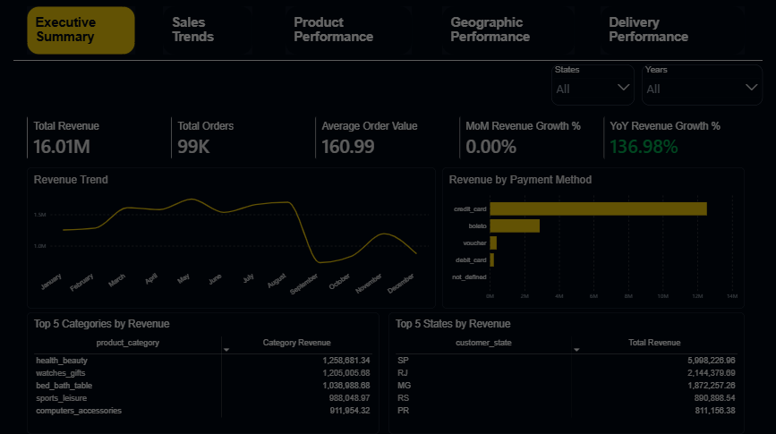

# Olist E-Commerce Sales Dashboard (PostgreSQL + Power BI)

An end-to-end Business Intelligence project that turns the public **Olist Brazilian E-Commerce** dataset (2016–2018) into an interactive, multi-page Power BI report. Raw CSVs are loaded into PostgreSQL, cleaned and documented, modeled into SQL views, and consumed by Power BI through a DAX measure layer.

> **Status:** Data pipeline, model, KPIs and dashboard design are complete. Dashboard build and business insights are in progress. <!-- Update this line when Phases 11–12 are done -->


<!-- Add a screenshot or GIF of the Executive Overview page -->

---

## Table of Contents

1. [Business Problem](#business-problem)
2. [Business Objectives](#business-objectives)
3. [Dataset](#dataset)
4. [Tech Stack](#tech-stack)
5. [Project Workflow](#project-workflow)
6. [Data Cleaning](#data-cleaning)
7. [Data Model](#data-model)
8. [KPIs](#kpis)
9. [Dashboard Overview](#dashboard-overview)
10. [Key Insights](#key-insights)
11. [Business Recommendations](#business-recommendations)
12. [Challenges & Lessons Learned](#challenges--lessons-learned)
13. [Limitations](#limitations)
14. [Future Improvements](#future-improvements)
15. [Repository Structure](#repository-structure)
16. [How to Reproduce](#how-to-reproduce)

---

## Business Problem

Olist generates large volumes of transactional data across customers, orders, products, payments, and deliveries. Without a centralized dashboard, stakeholders struggle to monitor overall performance, identify high-performing product categories, understand regional demand, and evaluate delivery efficiency. This project consolidates those metrics into a single, interactive reporting solution.

**Stakeholders:** Executive/Commercial Leadership · Category/Merchandising Managers · Regional/Sales Managers · Logistics/Operations · Finance

## Business Objectives

| # | Objective | Example Questions Answered |
|---|-----------|----------------------------|
| 1 | Monitor revenue performance | How much revenue are we generating? What is the AOV and order volume? |
| 2 | Analyze sales trends | How do sales change monthly and seasonally? |
| 3 | Evaluate product & geographic performance | Which categories and customer states drive the most sales? |
| 4 | Assess delivery performance | Are deliveries on time? Where are the bottlenecks? |

**Out of scope (by design):** customer satisfaction, review scores, and sentiment analysis. The `order_reviews` and `sellers` tables were intentionally excluded so the project stays focused on commercial and operational performance.

## Dataset

The [Olist Brazilian E-Commerce Public Dataset](https://www.kaggle.com/datasets/olistbr/brazilian-ecommerce) contains anonymized orders placed on a Brazilian marketplace between 2016 and 2018. All monetary values are in Brazilian Real (BRL).

| Table | Rows | Grain |
|-------|-----:|-------|
| `orders` | 99,441 | One row per order |
| `order_items` | 112,650 | One row per item within an order |
| `order_payments` | 103,886 | One row per order + payment sequence |
| `customers` | 99,441 | One row per order-scoped `customer_id` |
| `products` | 32,951 | One row per product |
| `product_category_name_translation` | 71 (+2 added) | One row per category |
| `geolocation` | ~1M (deduplicated during cleaning) | Zip prefix → lat/lng lookup |
| `sellers` | 3,095 | Out of scope |
| `order_reviews` | 99,224 | Out of scope |

## Tech Stack

| Layer | Tool |
|-------|------|
| Data loading | Python, Pandas, SQLAlchemy (`load_csv_to_postgres.py`) |
| Storage & cleaning | PostgreSQL (`olist_db`) |
| Investigative EDA | SQL + Jupyter Notebook |
| Modeling | PostgreSQL Views |
| Reporting | Power BI Desktop (Import mode), DAX |

## Project Workflow

The project follows a gated, phase-based lifecycle, with each phase closed by a documented deliverable.

| Phase | Description | Status |
|-------|-------------|--------|
| 1 | Business Understanding | ✅ |
| 2 | Data Understanding | ✅ |
| 3 | Data Loading | ✅ |
| 4 | Data Cleaning | ✅ |
| 5 | Data Modeling | ✅ |
| 6 | Exploratory Data Analysis | ✅ |
| 7 | Power BI Connection | ✅ |
| 8 | KPI Design | ✅ |
| 9 | DAX Development | ✅ |
| 10 | Dashboard Planning | ✅ |
| 11 | Dashboard Development | 🔄 In progress |
| 12 | Business Insights | ⏳ |
| 13 | Documentation | 🔄 This README |

## Data Cleaning

Raw data was preserved wherever possible. Anomalies that couldn't be confidently corrected were **flagged and excluded at the reporting layer** rather than deleted or imputed. Full detail lives in the [Data Cleaning Log](docs/Olist_Data_Cleaning_Log.docx).

| Table | Issue | Action |
|-------|-------|--------|
| `orders` | Nulls in approval/carrier/delivery dates | Kept; expected for non-delivered orders. KPIs scoped to `delivered` |
| `orders` | ~1,382 orders with illogical date sequences (consistent ~15-day gap) | Flagged and excluded from delivery KPIs only; revenue unaffected |
| `order_payments` | 2 credit-card rows with 0 installments; 3 `not_defined` payment rows | Left as-is; excluded from installment / payment-method analysis only |
| `customers` | `customer_id` is order-scoped; `customer_unique_id` is person-scoped | Documented; modeled at `customer_id` grain |
| `customers` / `geolocation` | Zip prefixes stored as integers (leading zeros lost) | Converted to `VARCHAR(5)` with `LPAD` |
| `geolocation` | 261,831 exact duplicate rows | Deduplicated |
| `geolocation` | 33 rows with corrupted coordinates | Flagged; excluded from map visuals only |
| `products` | 610 products missing category | Bucketed as `Uncategorized` via `COALESCE` |
| `product_category_name_translation` | 2 missing translations (`pc_gamer`, `portateis_cozinha_e_preparadores_de_alimentos`) | Rows added |

## Data Model

A **galaxy (fact constellation) schema** built from six PostgreSQL views. Three fact views are used because `payment_value` (order grain) and `price` (item grain) can't be combined in one table without producing misleading aggregations.

```
                    ┌──────────────┐
                    │  dim_date    │
                    └──────┬───────┘
                           │ (order_purchase_date: active)
┌──────────────┐    ┌──────▼───────┐    ┌──────────────────┐
│ dim_customers├────► fact_orders   ◄────┤  fact_payments   │
└──────────────┘    └──────┬───────┘    └──────────────────┘
                           │
                    ┌──────▼───────────┐    ┌──────────────┐
                    │ fact_order_items ├────► dim_products │
                    └──────────────────┘    └──────────────┘
```
<!-- Replace with a screenshot of your Power BI Model view -->

| View | Type | Grain | Purpose |
|------|------|-------|---------|
| `fact_orders` | Fact | Order | Primary revenue, order volume, and delivery-timing view |
| `fact_order_items` | Fact | Order item | Category-level sales (`price`) |
| `fact_payments` | Fact | Order + payment sequence | Payment-method breakdown |
| `dim_date` | Dimension | Day | Time intelligence |
| `dim_customers` | Dimension | Order-scoped customer | Customer-side (demand) geography |
| `dim_products` | Dimension | Product | Category and English translation |

### Key modeling decisions

- **Single active date relationship.** `dim_date → fact_orders` is active on `order_purchase_date`. The four delivery-date relationships are inactive and activated in DAX via `USERELATIONSHIP()`, which avoids ambiguous filter paths.
- **Single-direction filtering** from `dim_customers` to `fact_orders`, avoiding unintended cross-filtering.
- **Revenue = `payment_value`**, scoped to `order_status = 'delivered'`.
- **Category revenue = `SUM(price)`** from `fact_order_items`. This is intentionally *not* reconciled to `payment_value` (which includes freight and fees), and is documented as a scoping decision.
- **AOV** is reported as the mean, with the median shown as context because order values are right-skewed.
- **Growth** uses a comparable Jan–Aug window. The 2016 pilot period is excluded and partial Aug 2018 is retained with a caveat.
- **Category rankings** apply a ≥100 order threshold before identifying fast-growing or bottom categories.
- **Delivery-eligible population:** ~95,082 delivered orders with valid date sequences.

## KPIs

<!-- Replace/adjust with your final Phase 8 KPI set and DAX names -->

| Tier | KPI | Objective |
|------|-----|-----------|
| Executive | Total Revenue, Total Orders, Average Order Value (mean + median) | 1 |
| Executive | Month-over-Month / Year-over-Year Revenue Growth | 2 |
| Performance | Top N Categories by Revenue and Order Volume | 3 |
| Performance | Revenue by Customer State | 3 |
| Performance | On-Time Delivery Rate, Average Delivery Time | 4 |
| Diagnostic | Late Delivery Rate by Region, Payment Method Mix | 3, 4 |

## Dashboard Overview

Five report pages, designed around the KPI tiers:

| Page | Focus |
|------|-------|
| Executive Overview | Headline KPIs and revenue trend |
| Sales Trends | Monthly and seasonal patterns, growth |
| Product Performance | Top and bottom categories by revenue and volume |
| Geographic Performance | Customer-state demand distribution |
| Delivery Performance | On-time rate, delivery time, regional bottlenecks |

<!-- Add one screenshot per page under docs/images/ -->

## Key Insights

<!-- Fill in after Phase 12. Keep observations (what the data shows) separate from recommendations (what to do). -->

- **[Insight 1]:** _e.g. revenue trend and growth observation, with the figure_
- **[Insight 2]:** _e.g. category concentration_
- **[Insight 3]:** _e.g. geographic concentration of demand_
- **[Insight 4]:** _e.g. delivery performance vs. estimated dates_

## Business Recommendations

<!-- Each recommendation should point back to a specific insight above -->

1. **[Recommendation]** — based on Insight 1
2. **[Recommendation]** — based on Insight 3
3. **[Recommendation]** — based on Insight 4

## Challenges & Lessons Learned

- **Mixed grains.** Order-level payments and item-level prices double-count if joined naively. This led to the three-fact galaxy design.
- **Ambiguous filter paths in Power BI.** Multiple date columns on `fact_orders` created a cycle, resolved with one active relationship plus `USERELATIONSHIP()`.
- **Two customer identifiers.** `customer_id` vs. `customer_unique_id` forced an explicit grain decision and documented limits on repeat-customer analysis.
- **Anomalies with unknown cause.** The ~15-day timestamp gap couldn't be corrected safely, so records were excluded from the affected KPIs and disclosed rather than guessed at.
- **Leading zeros lost in zip codes.** Caught during cleaning and fixed before it could corrupt geographic joins.

## Limitations

- Historical dataset (2016–2018), not a live feed; Aug 2018 is a partial month and 2016 is a small pilot period.
- Geography is customer-side only; seller and fulfillment location are excluded.
- Category revenue (`price`) doesn't reconcile to total revenue (`payment_value`).
- Customer satisfaction and review data are out of scope.
- ~1.4% of orders are excluded from delivery KPIs because of timestamp anomalies.
- One delivered order has line items but no payment record (retained for order count; zero revenue impact).
- Repeat-purchase analysis isn't supported at the current customer-dimension grain.

## Future Improvements

- Add a `customer_unique_id`-based dimension for retention and repeat-purchase analysis.
- Bring in the reviews table to relate delivery delays to customer satisfaction.
- Add seller-side analysis (fulfillment location vs. customer location, freight cost).
- Add a map visual using the cleaned, aggregated geolocation data.
- Switch to incremental refresh or DirectQuery for a larger or live dataset.

## Repository Structure

```
olist-bi-dashboard/
├── README.md
├── data/                      # source CSVs (or link to Kaggle)
├── sql/
│   ├── 01_create_tables.sql
│   ├── 02_cleaning.sql
│   ├── 03_views.sql           # fact_ and dim_ views
│   └── 04_eda_queries.sql
├── python/
│   └── load_csv_to_postgres.py
├── notebooks/
│   └── eda.ipynb
├── powerbi/
│   └── olist_dashboard.pbix
└── docs/
    ├── images/
    ├── Olist_Business_Understanding.docx
    └── Olist_Data_Cleaning_Log.docx
```

## How to Reproduce

1. Download the dataset from [Kaggle](https://www.kaggle.com/datasets/olistbr/brazilian-ecommerce) into `data/`.
2. Create a PostgreSQL database named `olist_db`.
3. Update the connection string in `python/load_csv_to_postgres.py`, then run it to load the CSVs.
4. Run the SQL scripts in `sql/` in order to clean the data and create the six views.
5. Open `powerbi/olist_dashboard.pbix`, point the PostgreSQL connection at your server, and refresh.

---

**Author:** Kolade · [LinkedIn](#) · [Portfolio](#)