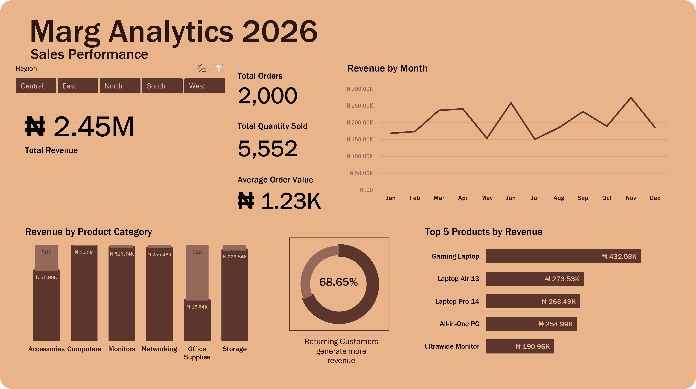

# Marg Analytics — Sales Performance Dashboard

A quick-turnaround Power BI dashboard built from an order-level sales dataset, covering revenue, orders, quantity sold, average order value, monthly trends, regions, product categories, and top products.

<!-- Update path/filename once the image is added to the repo -->

> **Note:** This was a fast-turnaround exercise (data received, cleaned, and dashboarded in one sitting), not a full end-to-end BI lifecycle project. See [Scope & Limitations](#scope--limitations).

---

## Business Scenario

A manager needed a dashboard to review sales performance from order-level data, covering:

- Total revenue, orders, quantity sold, and average order value
- Monthly revenue trends
- Regional performance
- Product category performance
- Top-selling products
- Returning vs. new customer contribution to revenue

## What the Dashboard Shows

| Section | Metric(s) |
|---|---|
| Headline KPIs | Total Revenue (₦1.02M), Total Orders (825), Total Quantity Sold (2,251), Average Order Value (₦1.24K) |
| Revenue by Month | Monthly revenue trend, Jan–Dec |
| Revenue by Product Category | Accessories, Computers, Monitors, Networking, Office Supplies, Storage |
| Returning Customer Contribution | 69.45% of revenue from returning customers |
| Top 5 Products by Revenue | Gaming Laptop, All-in-One PC, Laptop Air 13, Laptop Pro 14, Ultrawide Monitor |
| Region Filter | Central, East, North, South, West |

## Key Observations

- **Computers is the leading category by revenue** (₦587.23K), well ahead of Monitors (₦221.51K) and Networking (₦94.48K).
- **Gaming Laptop is the single best-selling product** (₦190.94K), nearly double the next-highest product.
- **Returning customers drive the majority of revenue** (69.45%), suggesting retention matters more than pure acquisition for this business.
- **Revenue is volatile month to month**, with a sharp spike in June and a trough in May — worth investigating what drove each (promotion, seasonality, stockout, etc.).

## Tech Stack

- Microsoft Excel (data cleaning, calculations, and dashboard build)
- Source: order-level sales dataset (provided, not published in this repo — see [Data](#data))

## Data

The raw dataset was shared directly and isn't included in this repository. It contains order-level records with fields for date, region, product category, product, quantity, and revenue/price, sufficient to compute the KPIs above.

## Scope & Limitations

- Built quickly from a single dataset with no formal Business Understanding, Data Cleaning Log, or documented modeling decisions — unlike a full end-to-end BI project.
- No prior-period (e.g. 2025) data was available, so trend commentary is based on within-year (monthly) patterns only, not year-over-year growth.
- Region filter behavior (single- vs. multi-select) and category chart labeling are being revisited — see [Known Issues](#known-issues).
- "Returning customer" definition (e.g. based on repeat order ID, customer ID, or another field) is not yet documented and should be clarified before sharing externally.

## Known Issues

- [ ] Revenue by Product Category chart shows two overlapping values per bar with no legend — needs to be split into two charts or relabeled.
- [ ] Region filter buttons show two regions (Central, East) highlighted simultaneously — filter behavior needs to be confirmed and made visually unambiguous.
- [ ] Returning-customer donut chart has no in-chart label explaining what the 69.45% represents.
- [ ] No explicit date range shown on the dashboard (assumed FY2026, Jan–Dec).

## How to Reproduce

1. Open `Marg_Analytics_Sales_Performance.xlsx` in Excel.
2. Point/refresh any linked data tables to your copy of the order-level dataset.
3. Refresh pivot tables/charts (Data → Refresh All).

---

**Author:** Kolade
